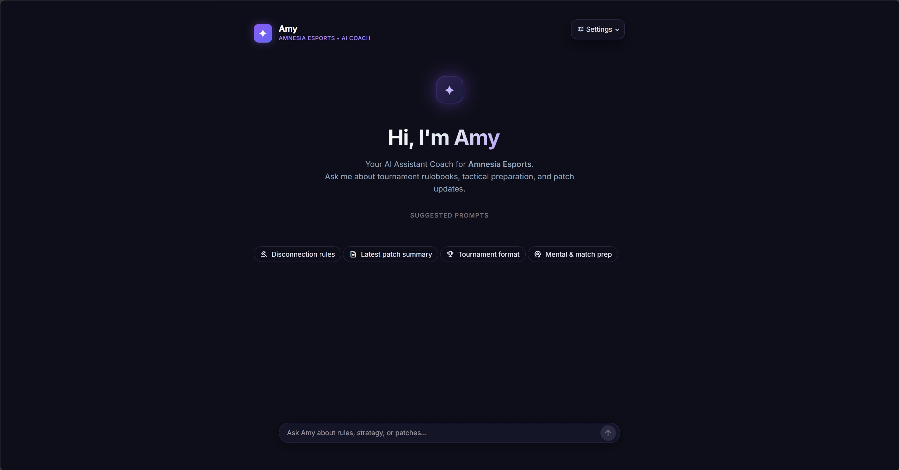

# Amy Team Chatbot

> Your tactical and regulatory companion.

Amy is an internal RAG-powered Assistant Coach for Amnesia Esports. It connects to the team's live documents (tournament rules, patch notes, tactical playbooks) and provides accurate, cited answers to help players and coaching staff prepare for competitive play.

Built with **FastAPI**, **LlamaIndex**, **Streamlit**, and **Google Gemini**.

<!-- Replace the path below with an actual screenshot of the chat interface -->


---

## Table of Contents

- [Features](#features)
- [Technology Stack](#technology-stack)
- [Local Development](#local-development)
- [Running with Docker](#running-with-docker)
- [Google Cloud Run Deployment](#google-cloud-run-deployment)
- [Project Structure](#project-structure)
- [Code Quality](#code-quality)

---

## Features

- **Retrieval-Augmented Generation (RAG)** -- Answers questions based strictly on the team's internal documents stored in a persistent vector database.
- **Source Citations** -- Every answer includes exact references to the source files (e.g., `valorant_patch_notes_9_04.md`), making it easy to verify information.
- **Optional Google Search Grounding** -- When enabled by the user, Amy can supplement document-based answers with live web results for questions that go beyond the local knowledge base.
- **Esports-Tuned System Prompt** -- The assistant is configured to behave as a professional esports coach: precise, direct, and scoped exclusively to the gaming domain.
- **Cloud-Native Architecture** -- Dockerized with a multi-stage build, ready to deploy on Google Cloud Run as a stateless, auto-scaling service.
- **Custom Chat Interface** -- A dark-themed Streamlit frontend with SVG-based avatars, suggestion chips, typing indicators, and a responsive layout.

---

## Technology Stack

| Layer            | Technology                                                        |
|------------------|-------------------------------------------------------------------|
| Backend API      | FastAPI (Python 3.11+)                                            |
| Frontend         | Streamlit                                                         |
| LLM              | Google Gemini 3.5 Flash Lite (via `google-genai` SDK)             |
| Embeddings       | Google `gemini-embedding-2`                                       |
| Web Grounding    | Native Google Search Grounding (`types.GoogleSearch`)             |
| Vector Database  | ChromaDB (persistent local storage)                               |
| Orchestration    | LlamaIndex                                                        |
| Containerization | Docker, Docker Compose, Google Cloud Run                          |

---

## Local Development

### Prerequisites

- Python 3.11 or higher
- A Google AI Studio API Key -- [get one here](https://aistudio.google.com/app/apikey)

### 1. Setup Environment

```bash
# Clone the repository
git clone https://github.com/Hevial/Amy-Team-Chatbot.git
cd amy-team-chatbot

# Create and activate a virtual environment
python -m venv .venv
source .venv/bin/activate        # Linux / macOS
.venv\Scripts\Activate.ps1       # Windows (PowerShell)

# Install dependencies
pip install -r requirements.txt
```

### 2. Configure Settings

Copy the example environment file and insert your API key:

```bash
cp .env.example .env
```

Open `.env` and set `GOOGLE_API_KEY` to the value you obtained from Google AI Studio. All other defaults are production-ready out of the box.

### 3. Ingest Documents

The `data/samples/` directory ships with sample rulebooks and patch notes. To generate embeddings and store them in ChromaDB, run:

```bash
python -m scripts.ingest
```

To add new documents, place Markdown, PDF, or plain text files in `data/samples/` and re-run the command with `--clear` to rebuild the index from scratch.

### 4. Run the Application

Start the backend and frontend in two separate terminal windows:

**FastAPI Backend:**

```bash
uvicorn src.main:app --reload --port 8080
```

| Resource     | URL                            |
|--------------|--------------------------------|
| Swagger Docs | http://localhost:8080/docs      |
| Health Check | http://localhost:8080/health    |

**Streamlit Frontend:**

```bash
streamlit run frontend/app.py --server.port 8501
```

| Resource        | URL                         |
|-----------------|-----------------------------|
| Chat Interface  | http://localhost:8501        |

---

## Running with Docker

Docker Compose starts both the API and the frontend, mounting the data and chroma directories for persistence.

```bash
# Ensure your .env file exists with the GOOGLE_API_KEY set
docker-compose up --build
```

| Service   | URL                                       |
|-----------|-------------------------------------------|
| Frontend  | [http://localhost:8501](http://localhost:8501)   |
| API Docs  | [http://localhost:8080/docs](http://localhost:8080/docs) |

> **Note:** Docker copies the source code into the image at build time. If you modify Python files, you need to rebuild with `docker-compose up --build`. For rapid iteration during development, running the backend and frontend natively (see above) is recommended.

---

## Google Cloud Run Deployment

This project is optimized for deployment on Google Cloud Run as a scalable, serverless container.

### Prerequisites

1. Install the [Google Cloud SDK](https://cloud.google.com/sdk/docs/install).
2. Authenticate: `gcloud auth login`
3. Set your project: `gcloud config set project YOUR_PROJECT_ID`
4. Enable Secret Manager and Cloud Build APIs in your GCP console.

### Deploy

Use the included deployment scripts:

**Windows (PowerShell):**

```powershell
.\deploy_gcp.ps1
```

**Linux / macOS:**

```bash
chmod +x deploy_gcp.sh
./deploy_gcp.sh
```

The scripts will:

1. Build the multi-stage Docker image via Google Cloud Build.
2. Push it to Artifact Registry.
3. Deploy a stateless Cloud Run service using the `$PORT` environment variable.
4. Pass the required LLM and embedding model settings.

---

## Project Structure

```text
amy-team-chatbot/
|-- data/                      Source documents (Markdown, PDFs, etc.)
|   +-- samples/               Demo files (Valorant rules, patch notes)
|-- chroma_db/                 Local vector database storage (git-ignored)
|-- frontend/
|   +-- app.py                 Streamlit chat interface
|-- scripts/
|   +-- ingest.py              Document embedding and ingestion pipeline
|-- src/
|   |-- __init__.py            Package metadata and version
|   |-- config.py              Pydantic settings and environment management
|   |-- engine.py              Hybrid RAG engine (ChromaDB + Google Search)
|   |-- main.py                FastAPI application and endpoint definitions
|   +-- models.py              Pydantic schemas for API request/response validation
|-- .env.example               Environment variables template
|-- .streamlit/config.toml     Streamlit theme and client configuration
|-- docker-compose.yml         Local multi-container setup
|-- Dockerfile                 Multi-stage build optimized for Cloud Run
|-- requirements.txt           Production dependencies
+-- requirements-dev.txt       Development dependencies (ruff, testing)
```

---

## Code Quality

This project enforces strict engineering standards:

- **Linting and Formatting** -- Enforced using [Ruff](https://docs.astral.sh/ruff/).
- **Git History** -- Follows [Conventional Commits](https://www.conventionalcommits.org/).
- **Type Safety** -- Strict Python type hints and Pydantic validation on all boundaries.

To run the linter and formatter:

```bash
ruff check src/ scripts/ frontend/
ruff format src/ scripts/ frontend/
```
